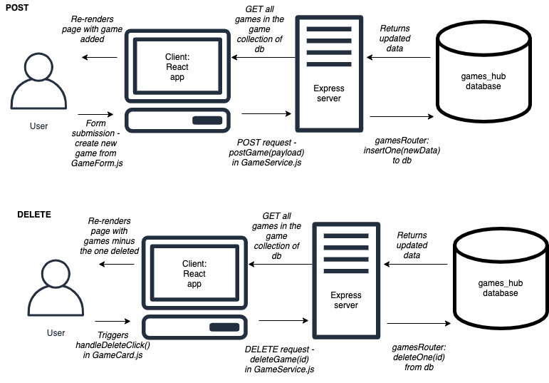

# Homework: Full Stack Games Hub App

## MVP

### Task

Draw a diagram showing the dataflow through the application starting with a form submission, ending with the re-rendering of the page. This will involve a multi-direction data-flow with the client posting data to the server and the server sending data back to the client with the response. Detail the client, server and database in the diagram and include the names of the files involved in the process.

### Questions

1. What is responsible for defining the routes of the `games` resource?

    *create_router.js*

2. What do you notice about the folder structure?  Whats the client responsible for? Whats the server responsible for?

    *The front end (React app) and the back end (Express server + MongoDB database) and separated into two different directories, respectively the client and the server.*

3. What are the the responsibilities of server.js?

    *Configuring the server.*

4. What are the responsibilities of the `gamesRouter`?

    *Does the routing for our games resource.*

5. What process does the the client (front-end) use to communicate with the server?

    *Make requests using HTTP methods to get back data.*

6. What optional second argument does the `fetch` method take? And what is it used for in this application? Hint: See [Using Fetch](https://developer.mozilla.org/en-US/docs/Web/API/Fetch_API/Using_Fetch) on the MDN docs

    *An init object to specify some settings. In this app, when the user updates the db by adding a new game, the client is listening for the POST request from the user and translates the added JS object to a JSON string.*

7. Which of the games API routes does the front-end application consume (i.e. make requests to)?

    */api/games/*
    *http://localhost:5000/api/games/*

8. What are we using the [MongoDB Driver](http://mongodb.github.io/node-mongodb-native/) for?

    *So we can interact with MongoDB using Promises or callbacks.*

## Extension

Why do we need to use [`ObjectId`](https://mongodb.github.io/node-mongodb-native/api-bson-generated/objectid.html) from the MongoDB driver?

*For requests that specify an object id, eg delete.*

Add to your diagram the dataflow for removing a game.